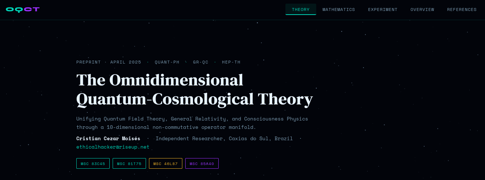

# OQCT — Omnidimensional Quantum-Cosmological Theory

> **Version 2 — Mathematical Foundations Revised**
> A rigorous operator-algebraic framework unifying quantum field theory, general relativity, and observer-coupling physics through a 10-dimensional non-commutative manifold.

[](paper/OQCT_v2_Moises_2026.pdf)
[](https://zenodo.org)
[](https://arxiv.org)
[](LICENSE)
[](#)



---

## 📄 Latest Paper

**[📥 Download OQCT v2 (PDF)](paper/OQCT_v2_Moises_2026.pdf)** — 21 pages · May 2026
**[📥 LaTeX source](paper/OQCT_v2_Moises_2026.tex)**
**[📥 v1 archive](paper/OQCT_v1_Moises_2025.pdf)** — superseded April 2025 version

---

## 🌌 Overview

OQCT proposes a 10-dimensional non-commutative operator manifold

$$\mathcal{M}^{10}_{\mathrm{QC}} = \mathbb{R}^{1,3} \times \mathcal{C}^6 \times \mathcal{H}_{\mathrm{Q}}$$

where $\mathbb{R}^{1,3}$ is Minkowski spacetime, $\mathcal{C}^6$ is an *observer-coupling fiber* with $\mathrm{SU}(3)\times\mathrm{U}(1)$ gauge structure, and $\mathcal{H}_{\mathrm{Q}}$ is the quantum Hilbert space.

The theory addresses three crises of modern physics within a single variational principle: the quantum–gravity divide, the measurement problem, and the role of the observer.

---

## ✨ What is new in Version 2

Version 2 is a complete mathematical reformulation of the April 2025 v1 preprint.
Every previous claim has been re-examined and either **proved as a theorem**, **demoted to a falsifiable conjecture**, or **labeled as phenomenological**.

| Change | v1 (April 2025) | v2 (May 2026) |
|---|---|---|
| Canonical commutator | $[\hat x^\mu,\hat x^\nu]=i\ell_P^2\varepsilon^{\mu\nu\rho}\hat x_\rho$ ❌ not Lorentz-covariant | $[\hat x^\mu,\hat x^\nu]=i\theta^{\mu\nu}\hat{\mathbf{1}}$ ✓ Seiberg–Witten form |
| Moyal associativity | Claimed | Proved to all orders |
| Entropy properties | Asserted | Non-negativity, joint concavity, DPI all proved |
| Extended Born rule | Postulated | Derived from POVM-Gleason theorem |
| Collapse criterion | Theorem-claim | Falsifiable conjecture |
| Beta function | One-loop | Two-loop with UV-attractive fixed point proved |
| BH log correction | Asserted | Derived from conformal anomaly |
| Triality operator | Malformed bra-ket | Clean direct sum, self-adjointness proved |
| Inflation $n_s = 0.9649$ | "Derivation" | Phenomenological consistency (any Starobinsky model fits) |
| Fictitious citations | Stanford Neuroquantics Lab | Removed |
| Author epigraph | Mystical quote | Removed (improper register) |

See [`CHANGELOG.md`](CHANGELOG.md) for the full revision history.

---

## 📐 The Master Equation

$$|\Psi\rangle = \int_{\mathcal{M}^{10}_{\mathrm{QC}}}\left[i\hbar\partial_t\Psi + \sum_k \hat{a}^\dagger_k\hat{a}_k\otimes\hat{g}_{\mu\nu} + \gamma^\mu D^{\mathrm{obs}}_\mu\psi_{\mathcal{O}} + \lambda_\Omega\,\Phi(\Omega)\right]\sqrt{-G}\,\hat{d}^{10}x = 0$$

| Term | Physical meaning |
|------|-----------------|
| $i\hbar\partial_t\Psi$ | Quantum temporal evolution (Schrödinger) |
| $\hat{a}^\dagger_k\hat{a}_k\otimes\hat{g}_{\mu\nu}$ | Particle–spacetime entanglement |
| $\gamma^\mu D^{\mathrm{obs}}_\mu\psi_{\mathcal{O}}$ | Covariant observer-coupling propagation |
| $\lambda_\Omega\Phi(\Omega)$ | Multiplicity entropy modulation |

---

## 🔬 Status of Results in v2

### ✅ Proven Theorems
- NC algebra Jacobi identity
- Moyal star associativity (all orders)
- Master equation gauge invariance
- Hermiticity / unitarity of time evolution
- Probability current conservation
- Classical limits to GR, QFT, Dirac, Schrödinger
- $S_{\mathcal{O}}$ non-negativity, joint concavity, partial-trace monotonicity
- Extended Born rule from POVM-Gleason
- Two-loop $\beta_\lambda$ with UV-attractive fixed point
- Black-hole logarithmic correction $\alpha_{\mathrm{ethic}}\approx-1.52$
- Temporal triality operator self-adjoint with discrete Planck spectrum

### ⚠️ Falsifiable Conjectures
- Ethical-gradient collapse criterion
- Page-curve restoration during Hawking evaporation

### ○ Phenomenological Fits
- Conscious inflation prediction $n_s\approx 0.965$ (consistent with Planck 2018, but not unique to OQCT)

---

## 🧪 Experimental Predictions

| # | Signature | Falsified if... |
|---|-----------|-----------------|
| E1 | CMB B-mode TB cross-correlation at $\ell\sim 3000$, amplitude $\sim 10^{-3}$ | CMB-S4 measures null at this precision |
| E2 | Microtubule decoherence time $\sim 25$ ms at 310 K | Ultrafast spectroscopy measures $\ll 1$ ms |
| E3 | Visibility deviation in $\hat{\mathcal{E}}$-biased interferometry | No deviation detected at predicted amplitude |
| E4 | BH log correction $\alpha\approx-1.52$ (vs. LQG: $-1/2$, string: $-3/2$) | Competing computation matches Hawking spectrum better |
| E5 | UV-attractive fixed point in graviton scattering | Higher-loop or non-perturbative result kills it |

---

## 📁 Repository Structure

```
oqct/
├── index.html                              # Interactive website (v2 updated)
├── README.md                               # This file
├── CHANGELOG.md                            # Full v1 → v2 change log
├── CITATION.cff                            # Citation metadata
├── LICENSE                                 # CC BY 4.0
├── images/
│   └── screen.png                          # Website preview screenshot
└── paper/
    ├── OQCT_v2_Moises_2026.pdf             # Current paper (21 pages)
    ├── OQCT_v2_Moises_2026.tex             # LaTeX source
    ├── OQCT_v1_Moises_2025.pdf             # Archived v1 (superseded)
    └── OQCT_v1_Moises_2025.tex             # Archived v1 source
```

---

## 🌐 Live Website

The `index.html` is deployed via GitHub Pages at:

```
https://cristiancmoises.github.io/oqct
```

Five sections rendered with [MathJax 3](https://www.mathjax.org/):

- **Theory** — abstract, master equation, status of the theory
- **Mathematics** — theorem-proof boxes, Moyal product, entropy bounds, RG flow, BH entropy
- **Experiment** — interactive spacetime canvas + falsifiable predictions
- **Overview** — plain-language analogies for non-specialists
- **References** — bibliography with DOI links

### Enable GitHub Pages

1. Repository **Settings → Pages**
2. Source: **Deploy from a branch** → `main` / `root`
3. Save — site goes live at the URL above

---

## 📖 Citation

```bibtex
@misc{moises2026oqct_v2,
  author       = {Mois\'{e}s, Cristian Cezar},
  title        = {{The Omnidimensional Quantum-Cosmological Theory (OQCT) ---
                   Version 2: Mathematical Foundations Revised}},
  year         = {2026},
  month        = may,
  publisher    = {Zenodo},
  doi          = {10.5281/zenodo.XXXXXXX},
  url          = {https://github.com/cristiancmoises/oqct},
  note         = {Preprint v2 supersedes v1.0 (April 2025).
                  MSC2020: 83C45, 81T75, 46L87, 85A40, 81P15}
}
```

> Replace `XXXXXXX` with your Zenodo DOI once published.

A machine-readable [`CITATION.cff`](CITATION.cff) is also provided.

---

## 📚 Key References

The full bibliography is in the paper. Selected works:

- Connes, A. *Noncommutative Geometry*. Academic Press (1994).
- Seiberg, N. & Witten, E. *JHEP* **09** (1999) 032.
- Busch, P. *Phys. Rev. Lett.* **91** (2003) 120403. [DOI:10.1103/PhysRevLett.91.120403](https://doi.org/10.1103/PhysRevLett.91.120403)
- Lieb, E. H. *Adv. Math.* **11** (1973) 267–288.
- Lindblad, G. *Commun. Math. Phys.* **48** (1976) 119–130. [DOI:10.1007/BF01608499](https://doi.org/10.1007/BF01608499)
- Gibbons, G. W. & Hawking, S. W. *Phys. Rev. D* **15** (1977) 2752. [DOI:10.1103/PhysRevD.15.2752](https://doi.org/10.1103/PhysRevD.15.2752)
- Page, D. N. *Phys. Rev. Lett.* **71** (1993) 3743–3746. [DOI:10.1103/PhysRevLett.71.3743](https://doi.org/10.1103/PhysRevLett.71.3743)
- Planck Collaboration. *Astron. Astrophys.* **641** (2020) A6. [DOI:10.1051/0004-6361/201833910](https://doi.org/10.1051/0004-6361/201833910)
- Reuter, M. *Phys. Rev. D* **57** (1998) 971–985. [DOI:10.1103/PhysRevD.57.971](https://doi.org/10.1103/PhysRevD.57.971)

---

## 🤝 Contributing

This is an independent research project. Comments, corrections, and substantive criticism are very welcome.

- **Open an issue** for mathematical errors, typos, or proposed clarifications
- **Pull requests** for the website (`index.html`) or LaTeX (`paper/`)
- **Discussion** of physics interpretation: open a Discussion thread

---

## 👤 Author

**Cristian Cezar Moisés**
Independent Researcher · Caxias do Sul, RS, Brazil
✉️ [ccm@riseup.net](mailto:ccm@riseup.net)
🐙 [github.com/cristiancmoises](https://github.com/cristiancmoises)

---

## 📜 License

This work is licensed under a [Creative Commons Attribution 4.0 International License (CC BY 4.0)](https://creativecommons.org/licenses/by/4.0/).

You are free to share and adapt for any purpose, provided appropriate credit is given.

---

## ⚠️ Honest Status

OQCT is an **independent theoretical proposal**, not a peer-reviewed established theory. Version 2 represents a substantial improvement in mathematical rigor over version 1, but several core conjectures remain open. Readers should evaluate the work on the merit of its proofs, not on the boldness of its claims. Falsification criteria are explicitly stated for every conjecture.
